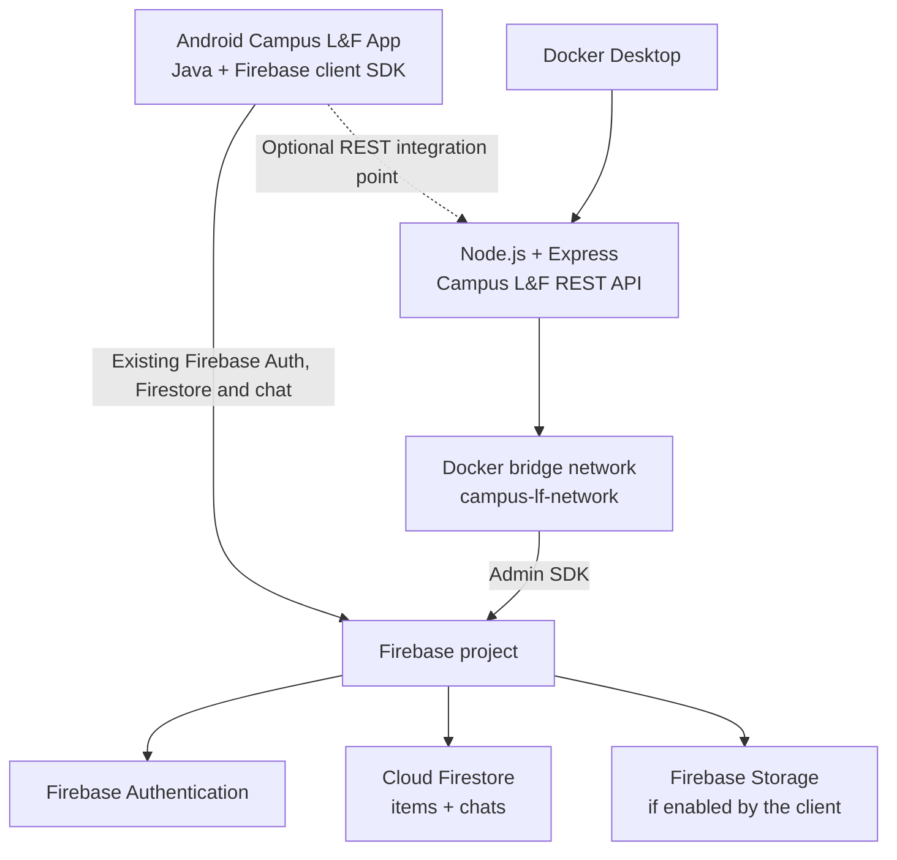

# Campus L&F - Docker-Based Cloud Application

## 1. Project Overview

Campus L&F (Campus Lost & Found) is a university lost-and-found application with a native Android client. Android authentication, real-time listeners, chat, and storage remain on Firebase, while item create/delete requests now go through the Dockerized Node.js and Express REST API. The API uses Firebase Admin SDK for server-side Firestore access.

The result satisfies the course's basic **Docker / VM-based cloud application** requirement and fits both **Containerized Web Application** and **Cloud-Based REST API Service**.

## 2. Cloud Architecture



The backend is intentionally additive. It does not replace the existing Android Firebase authentication, listeners, or chat implementation, so the current application behavior is preserved while Docker handles item write/delete operations.

## 3. Technologies

- Android native application: Java, Android SDK, Gradle
- Backend: Node.js 20, Express 4
- Firebase server access: Firebase Admin SDK
- Security middleware: Helmet, CORS
- Container runtime: Docker Desktop
- Orchestration for local demo: Docker Compose

## 4. Firebase Services

The existing Android application uses Firebase Authentication and Cloud Firestore. `StorageManager` reads and writes the `items` collection, listens for item changes, and stores chat messages in `chats/{itemId}/users/{userId}/messages`. `SharedPreferences` and Gson are retained as Android local cache storage.

The new backend uses Firebase Admin SDK. Admin credentials are read from environment variables and are never stored in source code. Firebase Admin access bypasses Firestore client rules, so production deployments must use a protected secret store and the API's Firebase ID-token validation.

## 5. Docker Architecture

- Image: `campus-lf-backend` built from `backend/Dockerfile`
- Service: `backend`
- Internal port: `3000`
- Local host port: `3000`
- Network: `campus-lf-network` (Docker bridge network)
- Restart policy: `unless-stopped`
- Healthcheck: `GET /api/health`

The container is stateless: it keeps no application data on its filesystem. Persistent data stays in Firebase, which allows additional backend instances to use the same data layer.

## 6. Backend API

| Method | Endpoint | Purpose | Authentication |
|---|---|---|---|
| GET | `/api/health` | Service and Firebase configuration status | Public |
| GET | `/api/items` | List items ordered by `createdAt` | Public |
| GET | `/api/items/:id` | Read one item | Public |
| POST | `/api/items` | Create an item in Firestore | Firebase ID token by default |
| PUT | `/api/items/:id` | Update an item | Owner/admin token by default |
| DELETE | `/api/items/:id` | Delete an item | Owner/admin token by default |

The item JSON shape follows the existing Firestore model: `title`, `category`, `type`, `location`, `date`, `contactName`, `contact`, `description`, `imageUri`, `status`, `creatorId`, and `createdAt`.

## 7. How To Run The Project

### Prerequisites

- Docker Desktop with Compose
- Firebase project with Firestore enabled
- A Firebase Admin service account for authenticated CRUD calls

### Configure secrets

The preferred Docker setup uses a service-account JSON file mounted read-only into the container. Because the previously shared private key is compromised, revoke it in Firebase Console and create a new key first. Then run:

```powershell
New-Item -ItemType Directory -Force secrets | Out-Null
Copy-Item "$env:USERPROFILE\Downloads\new-firebase-service-account.json" "secrets\firebase-service-account.json"
Copy-Item .env.example .env
```

Update the placeholder path in the command to the new JSON file. Never commit `.env`, service-account JSON files, or private keys. The root `.gitignore` excludes the entire `secrets/` directory.

### Start the backend

```powershell
docker compose up -d
```

Open `http://localhost:3000/api/health` or run:

```powershell
Invoke-RestMethod http://localhost:3000/api/health
```

The Android app keeps its existing Firebase configuration for Authentication, listeners, chat, and Storage. Its item write/delete REST base URL is `http://10.0.2.2:3000` on an Android emulator. A physical phone must use the computer's LAN IP, such as `http://192.168.1.10:3000`.

## 8. Docker Commands

```powershell
docker compose ps
docker compose logs backend
docker compose restart backend
docker compose stop backend
docker compose start backend
docker compose down
```

## 9. Network Architecture

Compose creates the `campus-lf-network` bridge network. The backend listens on port `3000` inside the container and is published to port `3000` on the Docker host. Firebase is an external managed service reached through HTTPS by the Firebase Admin SDK.

## 10. Security

- Firebase service-account credentials are injected as environment variables.
- `.env`, private keys, and service-account JSON files are ignored by Git.
- `helmet` adds standard HTTP security headers.
- Firebase ID tokens are required for write operations when `REQUIRE_AUTH=true`.
- Update and delete operations are limited to the item owner or a token with the `admin` claim.
- Firestore client Security Rules remain in place for direct Android access.

For local endpoint-only testing without credentials, set `REQUIRE_AUTH=false`; do not use that setting in a deployed environment. If the service-account file is missing or invalid, `/api/health` still starts but reports `firebase: false` and Firestore endpoints return `503`.

## 11. Failure Recovery

The Compose service uses `restart: unless-stopped`. To demonstrate recovery:

```powershell
docker compose stop backend
docker compose ps
Invoke-RestMethod http://localhost:3000/api/health
docker compose start backend
Invoke-RestMethod http://localhost:3000/api/health
```

The first health request fails while the service is stopped; it succeeds after the service starts again.

## 12. Scalability

The REST API is stateless and stores application data in Firestore, so multiple instances can share the same backend data. A production deployment would place a reverse proxy or load balancer in front of multiple instances. Local Compose exposes one host port for the basic course demo; this avoids pretending that two containers can bind the same host port without a load balancer.

## 13. Deployment Procedure

1. Install and start Docker Desktop.
2. Create `.env` from `.env.example`.
3. Build and start with `docker compose up -d --build`.
4. Confirm health with `docker compose ps` and `GET /api/health`.
5. Use the Android app with its existing Firebase project.
6. Stop with `docker compose down` when the demonstration is complete.

## 14. Demo Procedure

Use [DEMO_GUIDE.md](DEMO_GUIDE.md) for the professor presentation sequence, including health, logs, failure recovery, and scalability explanation.
