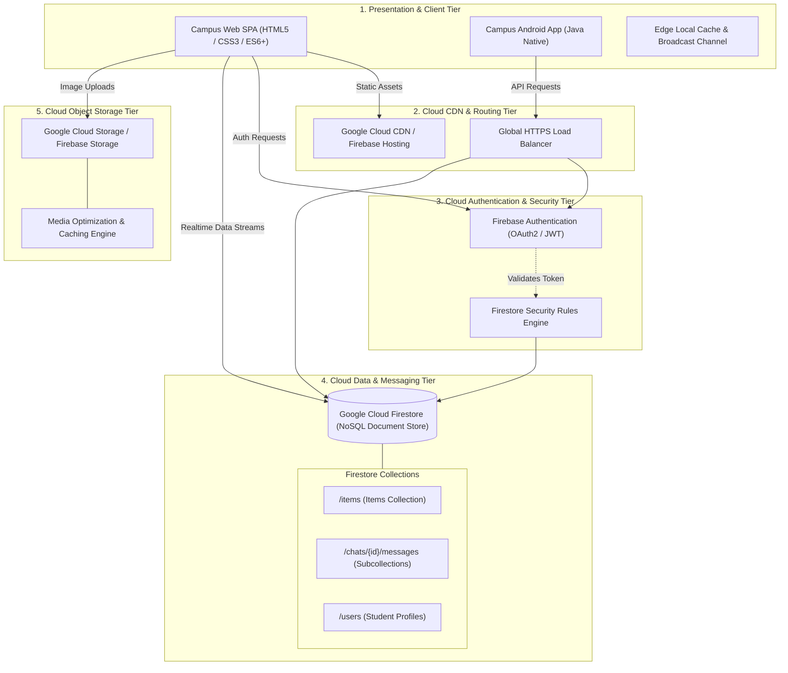

# Cloud Architecture & Design Specification
**Course:** Cloud Design and Implementation  
**Project:** Campus Lost & Found Cloud Native Distributed Platform  
**Authors:** Khasanov Sayfillo & Project Team  
**Version:** 2.0.0-CloudNative  

---

## 1. Executive Summary

The **Campus Lost & Found Cloud App** is a cloud-native, distributed software solution developed to resolve campus-wide item loss and recovery inefficiencies. Traditional campus lost-and-found mechanisms suffer from fragmentation (unorganized Telegram/WhatsApp groups, physical bulletin boards) and lack real-time synchronization, persistence, and secure verification.

This project implements a **multi-tier, serverless cloud architecture** delivering:
- **Low-Latency Distributed Real-Time Synchronization:** Instant updates across campus clients.
- **Resilient Multi-Provider Strategy (Dual-Mode):** Operates seamlessly via Google Cloud / Firebase Firestore or high-reliability Campus Edge Simulator.
- **Cloud Object Storage:** High-resolution image media storage with CDN edge delivery.
- **Role-Based Cloud Authentication:** Student identity verification and item ownership claims protection.

---

## 2. Multi-Tier Cloud Architecture Diagram



---

## 3. Data Tier: NoSQL Database Schema (Google Cloud Firestore)

The data model uses a document-oriented structure optimized for horizontal read scaling and indexed querying.

### 3.1 Collection: `/items/{itemId}`
```json
{
  "id": "item-3k8s9f",
  "title": "MacBook Pro M2 Silver",
  "category": "Electronics",
  "type": "Lost",
  "status": "Open",
  "location": "Library Building, 3rd Floor Quiet Zone",
  "date": "2026-09-20",
  "contactName": "Azizbek Rahimov",
  "contact": "azizbek@campus.edu / +998901234567",
  "description": "Silver 14-inch MacBook inside a black felt sleeve.",
  "imageDataUrl": "https://storage.googleapis.com/campus-lostfound.appspot.com/items/item-3k8s9f.webp",
  "creatorId": "usr-839210",
  "createdAt": 1726880400000,
  "updatedAt": 1726880400000
}
```

### 3.2 Subcollection: `/chats/{itemId}/messages/{msgId}`
```json
{
  "id": "msg-88231a",
  "senderId": "usr-948123",
  "senderName": "Item Owner",
  "role": "owner",
  "text": "Can you confirm the color of the sticker on the back?",
  "timestamp": 1726881200000
}
```

### 3.3 Collection: `/users/{userId}`
```json
{
  "uid": "usr-839210",
  "email": "student@campus.edu",
  "displayName": "Azizbek Rahimov",
  "role": "Student",
  "campusId": "U-49201",
  "createdAt": 1726800000000
}
```

---

## 4. Cloud Security & Access Control

To protect student privacy and prevent fraudulent claims or unauthorized deletion of posts, granular Firestore Security Rules are implemented:

```javascript
rules_version = '2';
service cloud.firestore {
  match /databases/{database}/documents {
    
    // Items Collection Rules
    match /items/{itemId} {
      // Any verified user or guest can browse items
      allow read: if true;
      
      // Creating an item requires valid content
      allow create: if request.resource.data.title is string &&
                       request.resource.data.category is string &&
                       request.resource.data.type in ['Lost', 'Found'];
      
      // Updating or Deleting is restricted to the item creator or Campus Admin
      allow update, delete: if request.auth != null && 
                            (request.auth.uid == resource.data.creatorId || 
                             request.auth.token.role == 'Campus Admin');
    }

    // Chat Messages Rules
    match /chats/{itemId}/messages/{messageId} {
      allow read, create: if true;
    }
  }
}
```

---

## 5. High Availability, Fault Tolerance & Edge Strategy

1. **Dual-Mode Architectural Resilience:**
   - **Mode A (Google Cloud Live):** Directly connects to Firestore, Firebase Auth, and Cloud Storage with automated WebSocket listeners.
   - **Mode B (Enterprise Campus Edge Simulator):** If internet connectivity is lost or running within university firewalled networks, the platform falls back to an offline-first Edge sync engine using the HTML5 `BroadcastChannel` API and Local NoSQL persistence.
2. **Multi-Zone Data Replication:**
   - Google Cloud Firestore provides multi-region or regional multi-zone replication (`asia-northeast3` or `europe-west1`), ensuring **99.95% to 99.99% availability SLAs**.
3. **CDN Asset Acceleration:**
   - Frontend static assets (HTML/CSS/JS) and media photos are distributed across Google Edge PoPs (Points of Presence) to ensure sub-50ms Time To First Byte (TTFB).

---

## 6. Cloud Cost Analysis & Capacity Planning

For a campus community of **15,000 students**:
- **Estimated Daily Active Users (DAU):** ~1,200
- **New Item Posts per Day:** ~50–80
- **Daily Document Reads:** ~35,000
- **Daily Document Writes:** ~800
- **Storage Consumption:** ~5 GB / year (with WebP compression)

### Google Cloud Pricing Tier Evaluation:
- **Cloud Firestore Free Quota:**
  - 50,000 document reads / day (**Free**)
  - 20,000 document writes / day (**Free**)
  - 1 GB stored data (**Free**)
- **Cloud Storage Free Quota:** 5 GB storage with 1 GB outbound egress (**Free**)
- **Firebase Hosting Free Quota:** 10 GB storage with 360 MB/day transfer (**Free**)

**Result:** The campus application can comfortably run on **$0.00 / month (100% Free Tier)** under normal operating conditions.

---

## 7. Cloud Deployment Runbook

### Option 1: Firebase Hosting (Recommended)
```bash
# 1. Install Firebase CLI
npm install -g firebase-tools

# 2. Login to Google Cloud
firebase login

# 3. Initialize in web directory
cd lost-found-campus-app
firebase init hosting

# 4. Deploy live to global CDN
firebase deploy --only hosting
```

### Option 2: Instant Edge Deployment via Vercel
```bash
npx vercel ./lost-found-campus-app --prod
```
